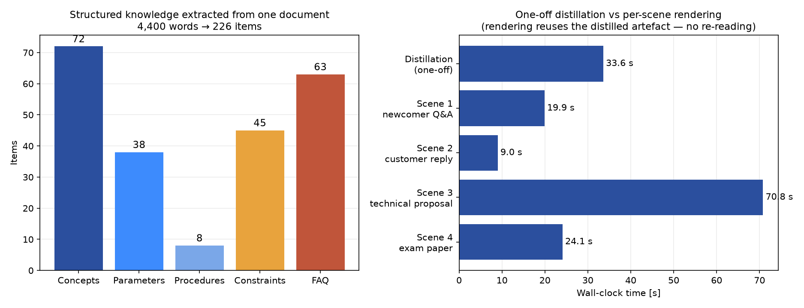

# Document Distillation Pipeline

**Turn any long technical document into a structured knowledge base once — then render task-specific outputs from templates, without re-reading the source.**



---

## The problem

A single technical document gets re-read dozens of times for different purposes:

- a customer asks whether they can parse your protocol → you skim it
- a newcomer asks what a term means → you skim it again
- you write a technical proposal → you extract the parameters again
- the team needs training material → you skim it a third time

Ask an LLM to answer from the document instead, and every request re-reads it: slower, more expensive, and — worse — **the answer drifts between runs**, because nothing is remembered.

**Distillation changes the shape of the work**: understand the document *once*, extract the substance into a structured artefact, then reuse it forever.

---

## Results at a glance

Run on a 4,400-word CAN protocol guide:

| Metric | Value |
|--------|-------|
| Semantic chunks | **14** (heading-aware, not fixed-length) |
| **Structured knowledge items** | **226** |
| — Concepts | 72 |
| — Parameters | 38 |
| — Procedures | 8 |
| — **Constraints** | **45** |
| — FAQ | 63 |
| One-off distillation time | **33.6 s** (parallel extraction) |
| Scene outputs generated | **4** (newcomer Q&A, customer reply, technical proposal, exam paper) |

The **45 constraints** are the most valuable output — each one carries its *reason*, e.g.

> **Do not treat padding beyond DLC as valid data.**
> Reason: when DLC = 2 but the data field carries 8 bytes, the last 6 are typically 0 or 0xAA padding. Treating them as data produces wrong results.

---

## How it works

```
  document
     │
     ▼
 ① CHUNK ──── semantic, follows the heading hierarchy (1,000–1,500 words each)
     │
     ▼
 ② EXTRACT ── 5 categories in parallel, every item traceable to its source chunk
     │        concepts · parameters · procedures · constraints · FAQ
     ▼
 ③ STRUCTURE ─ fixed JSON schema → ordinary programs can query it
     │
     ▼
 ④ RENDER ─── scenario templates:  same knowledge, different output shape
              (newcomer Q&A / customer reply / technical proposal / exam)
```

**Why it scales**: step ② runs once. Steps ④ reuse the artefact — no source re-reading, no per-request drift, and the output shape is controlled by a template rather than a prompt.

---

## Why not just "ask the LLM about the document"?

| | Ask the LLM each time | Distilled once |
|--|----------------------|----------------|
| Cost per question | Full document in context | Only the matched items |
| Latency | Grows with document size | Small and flat |
| **Consistency** | **Drifts between runs** | **Deterministic artefact** |
| Multi-scenario reuse | Re-derive each time | Template swap |
| Traceability | Usually none | Every item carries its source chunk |

---

## Engineering findings

These came up while building it and shaped the final design.

**1. Quality-sensitive stages must not use cheap models.**
Routing the "extract" stage to a free tier lost a critical distinction: the source said *"the transport layer is standardised, the payload is vendor-specific"* and the small model compressed it to *"not standardised"*. Distillation is a one-off investment that every downstream output depends on — a mistake there propagates everywhere.

**2. Reasoning models have a token-budget trap.**
With `max_tokens` set to 2,500, three of four scene outputs came back **empty** — the model had spent the entire budget on its internal reasoning. The same cause silently cut extraction from 226 items to 58. Fix: give reasoning models a generous budget (8,000–16,000) and detect empty outputs to retry.

**3. Chunking granularity is a real parameter.**
Too coarse and one chunk covers three topics (extraction goes vague); too fine and a single concept is split across five chunks (each one incomplete). The working range here: **1,000–1,500 words per chunk, aligned to heading boundaries**.

**4. Prompt braces bite.**
Technical documents contain JSON examples. Braces in a prompt that is later passed through string formatting collide — the first run failed **all 14 chunks** for this reason.

---

## Quick start

```bash
python -m venv .venv && source .venv/bin/activate     # or: uv venv .venv
pip install -r requirements.txt

# Set your API key (any OpenAI-compatible endpoint)
export DEEPSEEK_API_KEY="sk-..."

python distill.py samples/your-document.md --out out
```

Outputs:

```
out/knowledge.json      structured knowledge base (concepts/parameters/…)
out/scene_newbie.md     newcomer Q&A
out/scene_customer.md   customer reply
out/scene_proposal.md   technical proposal
out/scene_exam.md       training exam
```

Regenerate the figures:

```bash
python make_figures.py      # → results/distillation_results.png
```

---

## Project structure

```
doc-distill/
├── distill.py            # pipeline: chunk → extract → structure → render
├── make_figures.py       # result figures from the real artefact
├── samples/              # example artefacts (knowledge.json + 4 scenes)
├── out3/                 # reference run used for the figures
├── results/              # generated figures
├── README.md             # this file
└── README.zh.md          # Chinese version
```

---

## Limitations & next steps

- **Extraction quality tracks document quality** — a vague manual yields vague items; the pipeline does not invent missing structure.
- **No incremental update yet** — changing the source means re-distilling. A diff-based update (only re-extract changed chunks) is the obvious next step.
- **Retrieval is lexical** for the scene templates; swapping in embeddings would help on very large knowledge bases.
- **Evaluation is manual** — a rubric-based automatic scoring pass would make regressions visible.

---

*Built as a study of LLM-based information extraction: one-shot investment, reusable artefact. MIT licensed.*
